# guided-neural-style

## Introduction
This is a tensorflow implementation of spatially controlled neural style transfer. The techniques used are described or greatly inspired by materials below:

- [A Neural Algorithm of Artistic Style(Gatys et al.)](https://arxiv.org/abs/1508.06576)
- [Semantic Style Transfer and Turning Two-Bit Doodles into Fine Artworks(Champandard et al.)](http://arxiv.org/abs/1603.01768) and [its GitHub repository](https://github.com/alexjc/neural-doodle/)
- [Dmitry Ulyanov's blog post about the doodle algorithm](http://dmitryulyanov.github.io/feed-forward-neural-doodle/) and [its GitHub repository](https://github.com/DmitryUlyanov/fast-neural-doodle)
- The spatial control part of [Controlling Perceptual Factors in Neural Style Transfer(Gatys et al.)](https://arxiv.org/abs/1611.07865) and [its supplementary materials](http://bethgelab.org/media/uploads/stylecontrol/supplement/)

## Usage & Examples
It takes a few minutes on a GeForce GTX TITAN X GPU to produce a 512x512 pixel image for 1000 iterations.

Run `python stylize.py --help` or check `Parser.py` to see a full list of options.

### Simple Style Transfer
```
python stylize.py \
       --content_img='images/tubingen.png' \
       --style_img='images/starry-night.jpg' \
       --hard_width=512
```
`--hard_width` allows to resize content and style images to the specified width. If not set, the original shape will be used.

<p align="center">


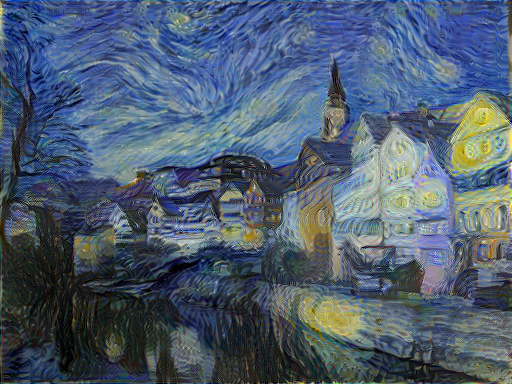
</p>

### Simple Texture Synthesis
```
python stylize.py \
       --style_img='images/flowers.png'
```
<p align="center">

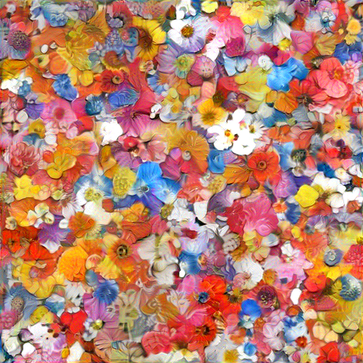<br>
(left: input; right: output)
</p>

### Guided Style Transfer 
`--mask_n_colors` specifies how many corresponding regions should be transfered. Default value is 1.

#### a) single(partial) mask
When `--mask_n_colors=1`, you can give 1 or 2 mask images(content mask or style mask or both) and the program will only transfer the corresponding white region of the mask. If content or style mask is not given, the whole region will be transfered.

```
python stylize.py \
       --mask_n_colors=1 \
       --content_img='images/house.jpg' \
       --target_mask='images/house_guide.jpg' \
       --style_img='images/castle.jpg' \
       --style_mask='images/castle_guide.jpg' \
       --hard_width=512
```
<p align="center">
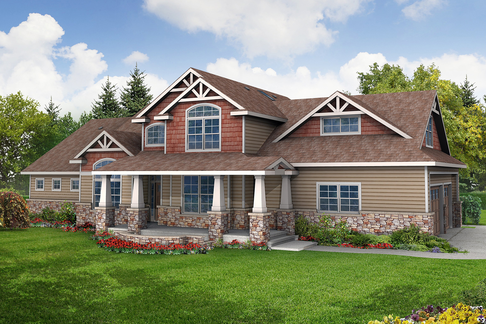


<br>(left to right: content image, target mask, style image, style mask)<br>
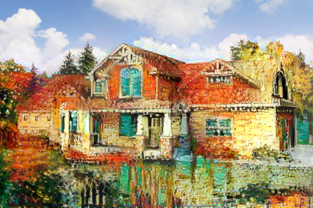
<br>(castle region -> house region, sky is unchanged)
</p>

```
python stylize.py \
       --mask_n_colors=1  \
       --content_img='images/house.jpg' \
       --target_mask='images/house_guide_2.jpg' \
       --style_img='images/starry-night.jpg' \
       --hard_width=512
```
<p align="center">
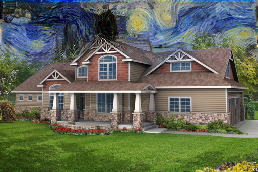
<br>(starry night -> sky region)
</p>

#### b) colorful(full) mask
When `--mask_n_colors` is set to larger than 1, you must give 2 masks using the same number of colors, and style will be transfered between every corresponding regions that have the same color.

```
python stylize.py \
       --mask_n_colors=2 \
       --content_img='images/house.jpg' \
       --target_mask='images/house_guide.jpg' \
       --style_img='images/castle.jpg' \
       --style_mask='images/castle_guide.jpg' \
       --hard_width=512
```
<p align="center">


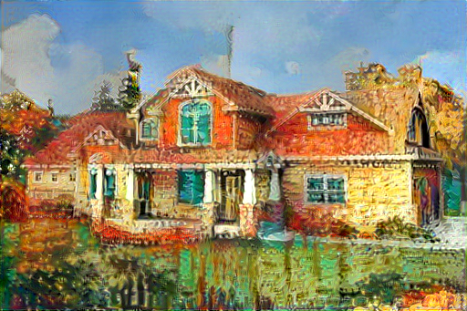
<br>(castle->house; sky->sky)
</p>

Other results:
<p align="center">


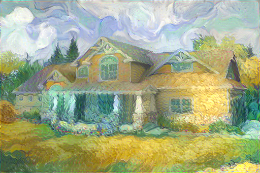
<br>(sky->sky; grass->house)
</p>

<p align="center">


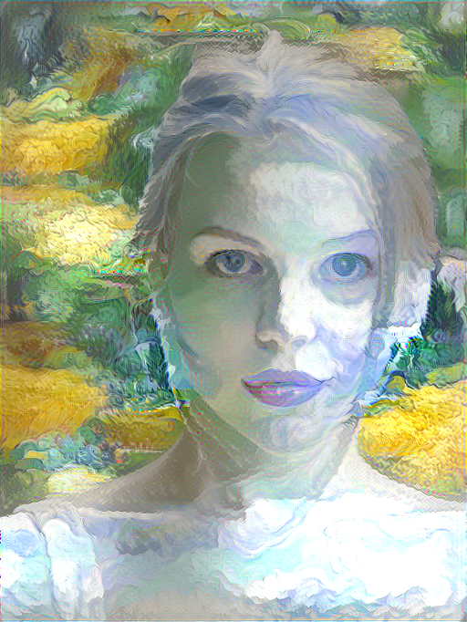
<br>(sky->face; grass->background)
</p>

Reproduce the transfered protraits in [Neural Doodle](https://github.com/alexjc/neural-doodle/):

<p align="center">


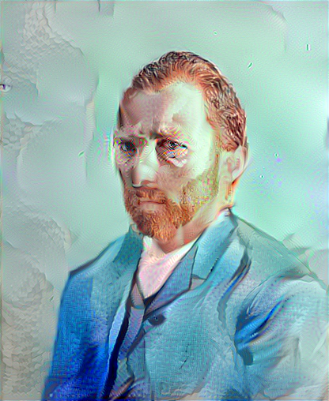<br>


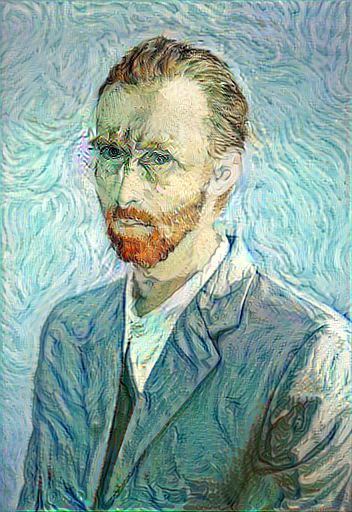<br>
(Perceptually, impressionist style is easier to transfer and has better result than realistic style.)
</p>

### Guided Texture Synthesis(Neural Doodle)
```
python stylize.py \
       --mask_n_colors=1 \
       --style_img='images/grass.jpg' \
       --style_mask='images/grass_guide_2.jpg' \
       --hard_width=512
```
<p align="center">

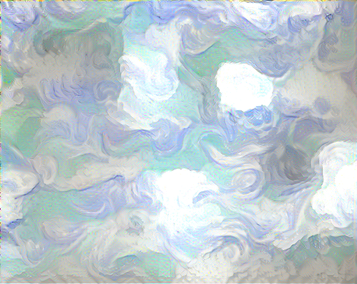
<br>(only capture the texture of sky region)
</p>

Reproduce the coastline image in [neural doodle](https://github.com/alexjc/neural-doodle/):
<p align="center">


<br>

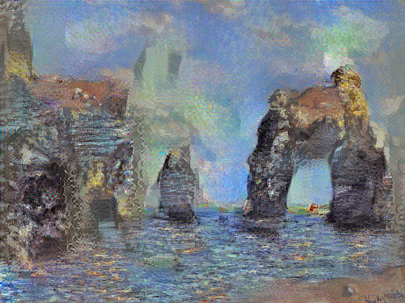
<br>(my result is not so good on the color boundaries. Please launch a pull request if you have some idea ^_^)
</p>


### Comparison: Different Mask Propagation Methods
Different mask manipulation methods control the actual receptive fields of specific regions. Here we reproduce the figure 2 from [supplementary material](http://bethgelab.org/media/uploads/stylecontrol/supplement/) of Gatys' paper.

There are 4 choices for `--mask_downsample_type`(default is 'simple'): 'simple', 'inside', 'all' and 'mean'. The first three get idea from Gatys' paper while 'mean' comes from Ulyanov's blog. My implementations are not completely the same.

<p align="center">

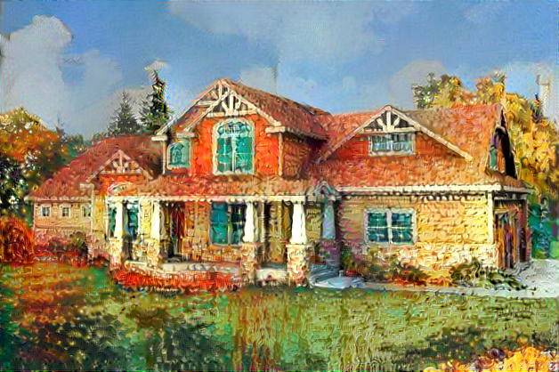
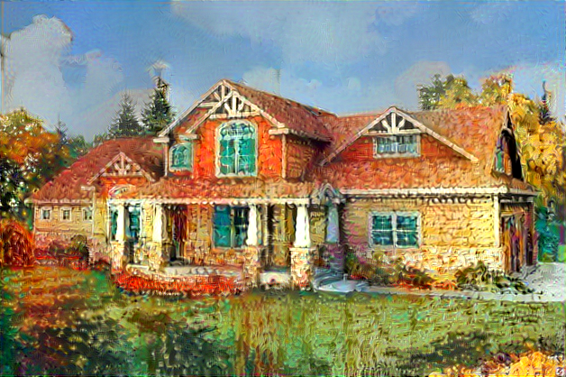
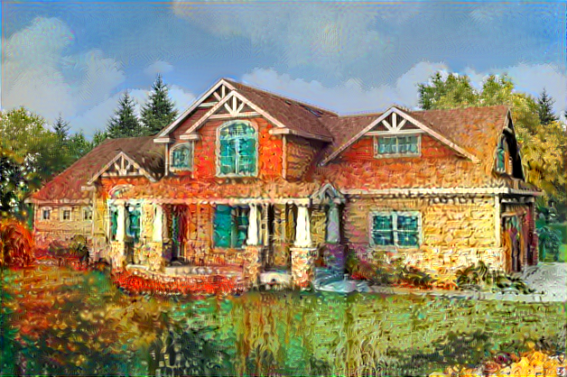
<br>(upper row: all, simple; lower row: mean, inside)
</p>

As we can see, with 'all' or 'simple' methods, the styles of sky and house are leaking into the other region(the clouds get style of yellow brick, the roofs become blurred); while with 'inside' method, the boundary is not well stylized. 'Mean' method is almost the same as 'simple'(I think 'mean' is a little bit better actually).


## Forthcoming
- transfering regional styles from multiple style sources
- discussion about some details and bad results

## Requirements
### Dependencies
- tensorflow >= 1.0
- numpy
- scipy
- Pillow (The image manipulation functions in scipy.misc need Pillow)
- sklearn

### Pretrained VGG-19 Model
VGG-19 Model: http://www.vlfeat.org/matconvnet/models/imagenet-vgg-verydeep-19.mat.

After downloading, put it in the top level of this repository.

## Acknowledgements
- [Cameron Smith's great code](https://github.com/cysmith/neural-style-tf) for tensorflow implementation of neural style.
- [Anish Athalye's code](https://github.com/anishathalye/neural-style) also helps a lot.
- [Dmitry Ulyanov's code](https://github.com/DmitryUlyanov/fast-neural-doodle) shows how to cluster colorful masks.
- Most images used in my experiments are from materials and repositories mentioned above.

## Citation
```
@misc{Wang2017,
  author = {Wang, Zirui},
  title = {guided-neural-style},
  year = {2017},
  publisher = {GitHub},
  journal = {GitHub repository},
  howpublished = {\url{https://github.com/wzirui/guided-neural-style}},
}
```


